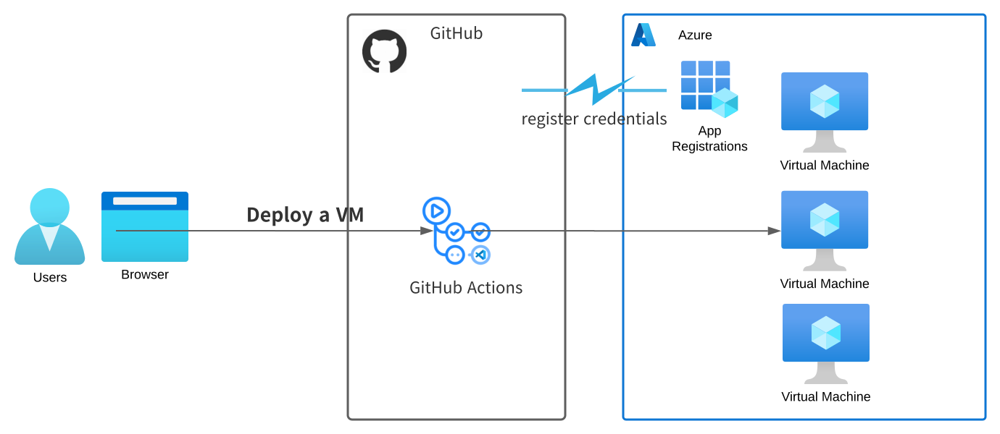

# azure-vm-provisioner
Provisioning Azure Virtual Machines via GitHub Actions

## Architecture



## Get started

Refer to [Quickstart: Deploy Bicep files by using GitHub Actions](https://learn.microsoft.com/en-us/azure/azure-resource-manager/bicep/deploy-github-actions?tabs=userlevel%2CCLI) for settings


0. Fork [ks6088ts-labs/azure-vm-provisioner](https://github.com/ks6088ts-labs/azure-vm-provisioner)
1. Generate deployment credentials

```shell
az ad sp create-for-rbac \
    --name "<your application name>" \
    --role contributor \
    --scopes "/subscriptions/<your subscriptionId>/resourceGroups/<your resource group name>" \
    --sdk-auth

{
"clientId": "<GUID>",
"clientSecret": "<GUID>",
"subscriptionId": "<GUID>",
"tenantId": "<GUID>",
(...)
}
```

2. Configure the GitHub secrets
Register the following secrets
- `AZURE_CREDENTIALS`: The entire JSON output from the Azure CLI command described in step1
- `AZURE_SUBSCRIPTION`: Your subscription ID

3. Run GitHub Actions
Go to GitHub Actions page, fill in parameters and run a job
